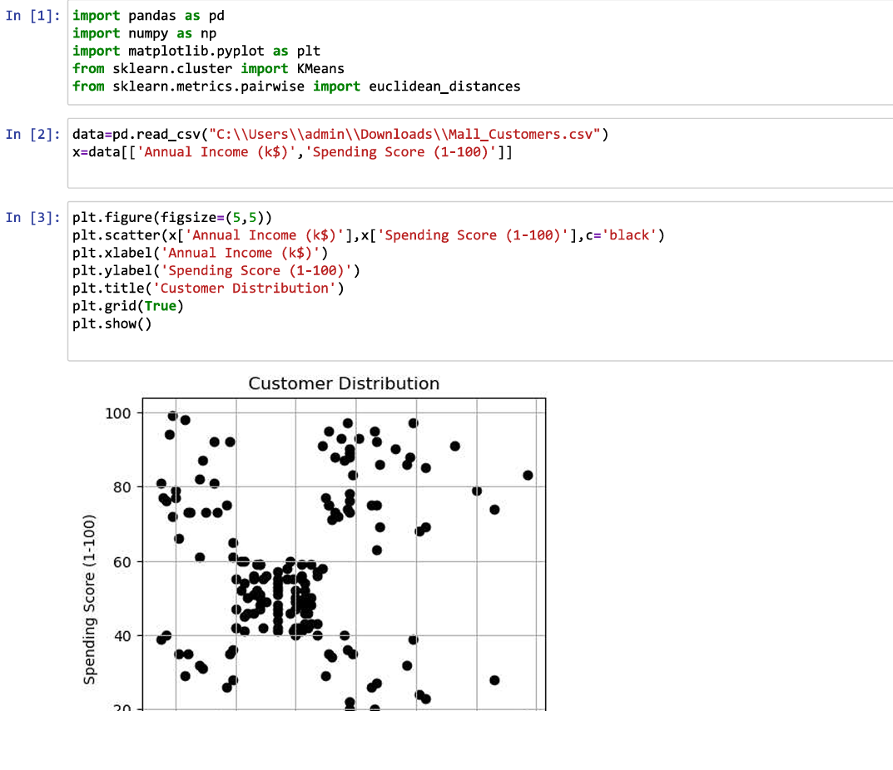
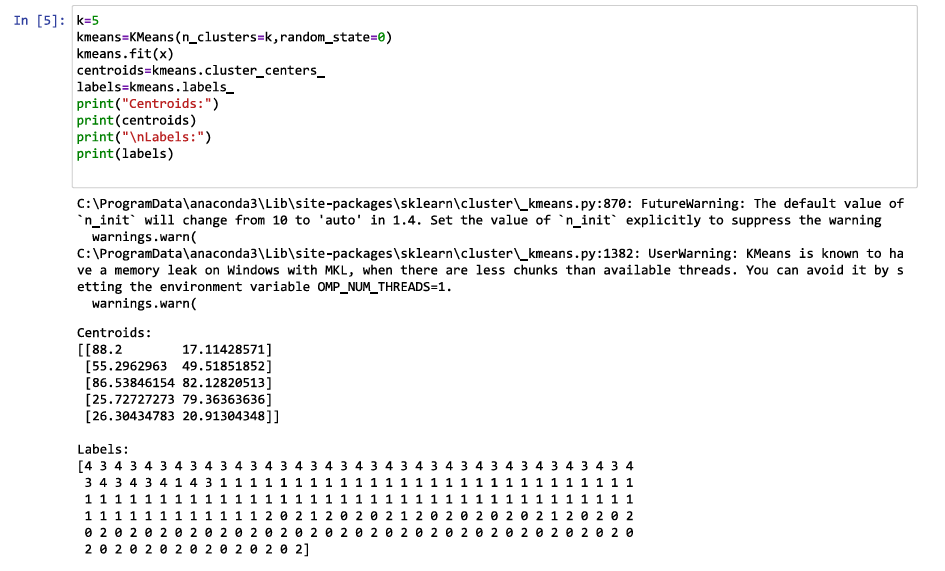
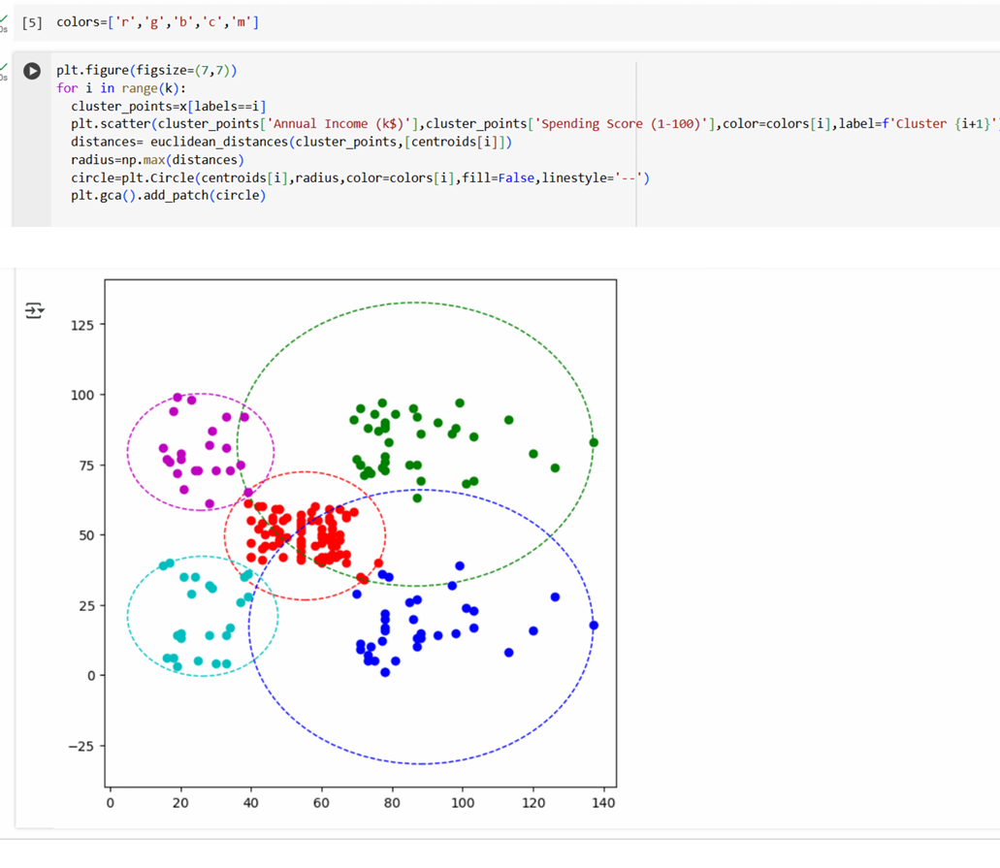
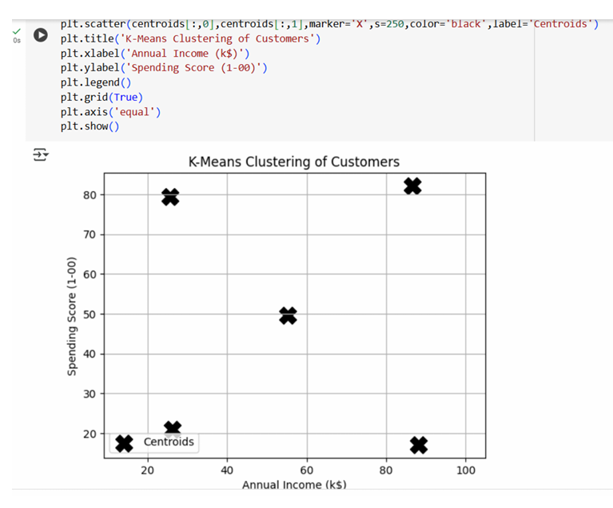

# Implementation-of-K-Means-Clustering-for-Customer-Segmentation

## AIM:
To write a program to implement the K Means Clustering for Customer Segmentation.

## Equipments Required:
1. Hardware – PCs
2. Anaconda – Python 3.7 Installation / Jupyter notebook

## Algorithm
1.  Import the necessary libraries(Pandas,Numpy,Matplotlib,scikit-learn)
2. Load the customer dataset and select relevant features(eg.Annual Income and Spending
 Score).
3. Visualize the data using a scatter plot
4. Choose the number of clusters (k) and apply the K-Means algorithms
5. Fit the model and predict the cluster for each data point.
6. Plot the clustered data with different colors and mark the cluster centers.
7. Draw minimum enclosing circles around each cluster to visualize spread

## Program:
```
Program to implement the K Means Clustering for Customer Segmentation.
Developed by: PRAGATHI KUMAR

RegisterNumber: 212224230200
import pandas as pd
import numpy as np
import matplotlib.pyplot as plt
from sklearn.cluster import KMeans
from sklearn.metrics.pairwise import euclidean_distances

data=pd.read_csv("/content/Mall_Customers.csv")
x=data[['Annual Income (k$)','Spending Score (1-100)']]

plt.figure(figsize=(5,5))
plt.scatter(x['Annual Income (k$)'],x['Spending Score (1-100)'],c='black')
plt.xlabel('Annual Income (k$)')
plt.ylabel('Spending Score (1-100)')
plt.title('Customer Distribution')
plt.grid(True)
plt.show()

k=5
kmeans=KMeans(n_clusters=k,random_state=0)
kmeans.fit(x)
centroids=kmeans.cluster_centers_
labels=kmeans. labels
print("Centroids:")
print(centroids)
print("\nLabels:")
print(labels)

colors=['r','g','b','c','m']

plt.figure(figsize=(7,7))
for i in range(k):
cluster_points=x[labels == i]
plt.scatter(cluster_points['Annual Income (k$)'],cluster_points['Spending Score (1-100)'],color=colors[i],label=f'Cluster {i+1}')
distances= euclidean_distances(cluster_points, [centroids[i]])
radius=np.max(distances)
circle=plt.Circle(centroids[i],radius,color=colors[i],fill=False,linestyle=' -- ')
plt.gca().add_patch(circle)

plt.scatter(centroids[:,0],centroids[:,1],marker='X",S=250,color="black',label='centroids")
plt.title('K-Means Clustering of Customers')
plt.xlabel('Annual Income (k$)')
plt.ylabel('Spending Score (1-ee)')
plt.legend()
plt.grid(True)
plt.axis('equal')
plt.show()
```

## Output:






## Result:
Thus the program to implement the K Means Clustering for Customer Segmentation is written and verified using python programming.
